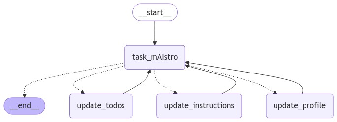

# 🤖 task_mAIstro – Personalized Memory-Aware Chatbot with LangGraph

This project implements a **memory-aware chatbot** using [LangGraph](https://github.com/langchain-ai/langgraph).  
It integrates **long-term memory management, task tracking, and self-updating instructions** to personalize interactions with users.  

The architecture combines:
- 🧠 **Memory Management**  
  Track user profile, ToDo list, and custom instructions across conversations.  
- 🔄 **Self-Updating Instructions**  
  Adapt how the chatbot handles tasks based on user feedback.  
- 🛠️ **Task-Oriented Reasoning**  
  Decide when to update profile, tasks, or instructions dynamically.  

---

## 🚀 Features
- 🧠 Maintain **user profiles** with personal info, interests, and connections.  
- 📋 Manage **ToDo lists** with tasks, deadlines, status, and suggested solutions.  
- 🔁 **Automatic memory updates** using Trustcall extractors.  
- ⚡ Graph-based orchestration with **LangGraph** for modular, conditional workflows.  
- 🛡️ Handle **tool calls** for profile, tasks, and instruction updates.  

---

## 📌 Use Cases
- Personal productivity assistant for **task tracking and reminders**.  
- Educational demo for **memory-aware chatbots**.  
- Building adaptive **multi-step reasoning agents** with LangGraph.  
- Testing **Trustcall extractors** and structured memory updates.  

---

## 🛠️ Tech Stack
- [LangGraph](https://github.com/langchain-ai/langgraph)  
- [LangChain](https://www.langchain.com/)  
- [OpenAI GPT-4o](https://platform.openai.com/) (chat model backend)  
- [Trustcall](https://trustcall.com/) for memory extraction  
- Python **3.11+**  

---

## 🧠 Workflow
The system follows a **graph-based memory pipeline**:

1. **task_mAIstro Node**  
   - Loads memories from the store (profile, ToDo, instructions).  
   - Generates personalized chatbot responses.  

2. **Memory Update Nodes**  
   - **update_profile** – updates the user profile if new information is provided.  
   - **update_todos** – updates the ToDo list when tasks are mentioned.  
   - **update_instructions** – updates custom task instructions based on user preferences.  

3. **Routing Logic**  
   - Conditional node `route_message` decides which memory node to trigger:  
     - `update_profile`, `update_todos`, or `update_instructions`  
   - Returns to `task_mAIstro` after updates.  

4. **Graph Execution**  
   - Starts at `task_mAIstro`  
   - Performs updates conditionally  
   - Loops back to continue conversation with updated memory  

---



---

## 🚀 Getting Started

Follow these steps to set up and run the project:

### 1. Install Python 3.11 or higher
Make sure you have **Python 3.11+** installed:

```bash
python --version


2. Install dependencies

```bash
pip install -r requirements.txt
```

3. Set up environment variables
Create a .env file in the root directory and configure the necessary environment variables.

💡 Example:
---- .env.example ----

4. Enable Tracing with LangSmith
LangSmith helps trace and debug your agents effectively.
Check out the:

[tracing](https://docs.smith.langchain.com/concepts/tracing).

5. (Optional) Use LangGraph Studio
You can launch an interactive development studio for LangGraph using:

```bash
langgraph dev

